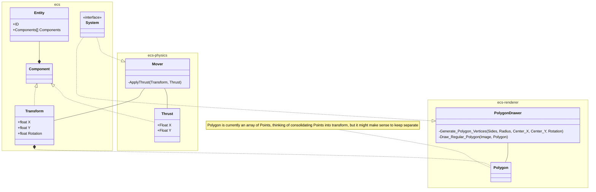

# PSU.Ada.GameEngine

https://github.com/users/apostasy/projects/1/views/1

# Getting Started
## Initial Setup
### Alire
Download from https://alire.ada.dev/ and install

After installation, run `alr version` to ensure alr has been added to system PATH/Environment Variables

### Visual Studio Code
Download from https://code.visualstudio.com/ and install

### Clone the repo

`git clone mailto:git@github.com:apostasy/PSU.Ada.GameEngine.git`

## Running the application

The command `alr build` will build the project.

The command `alr run` will run the project

## Entity Component System Diagram

